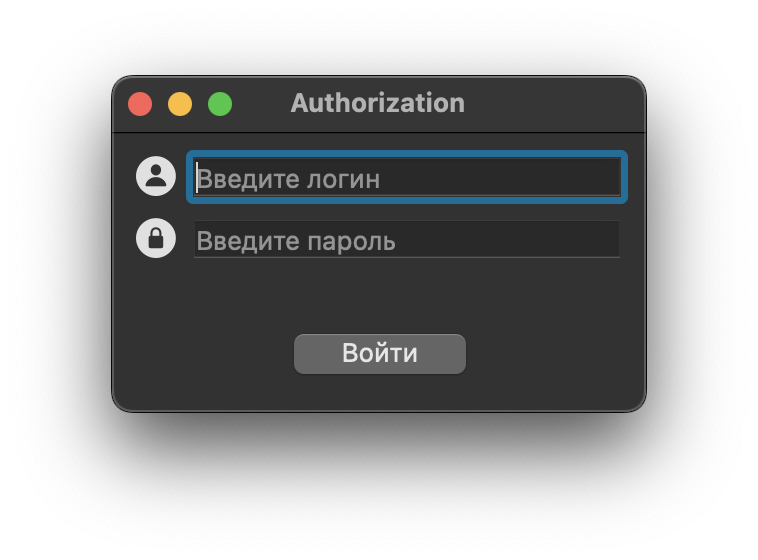
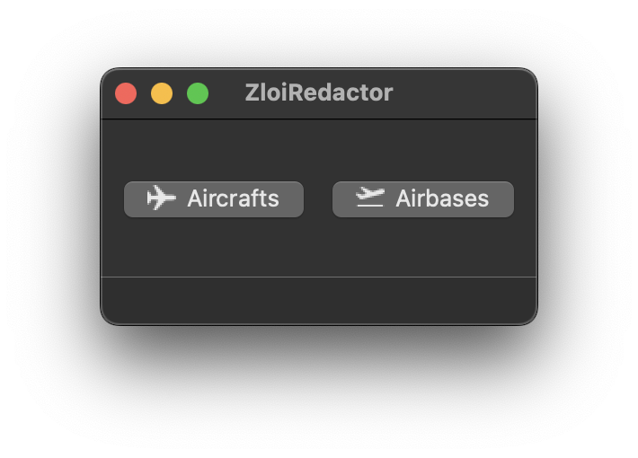
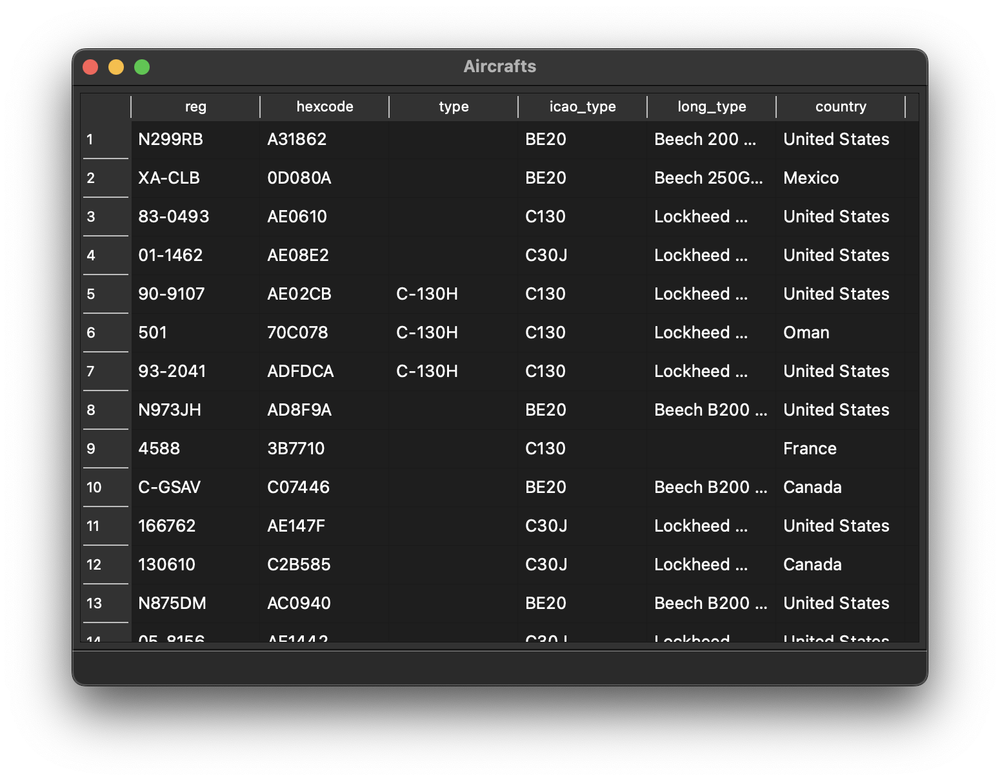
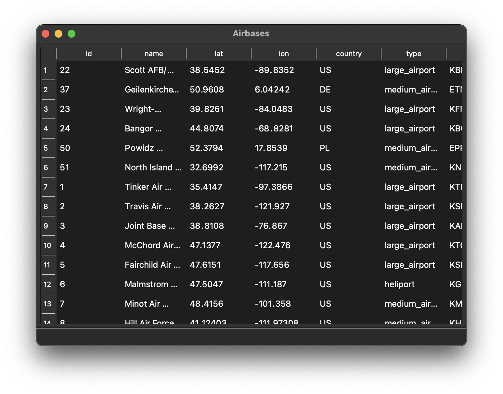
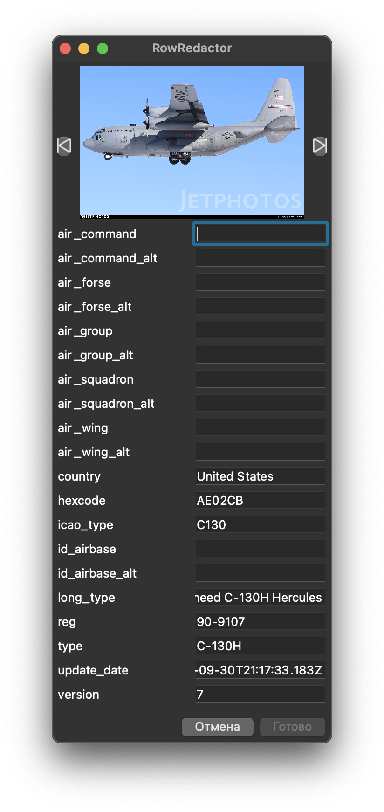
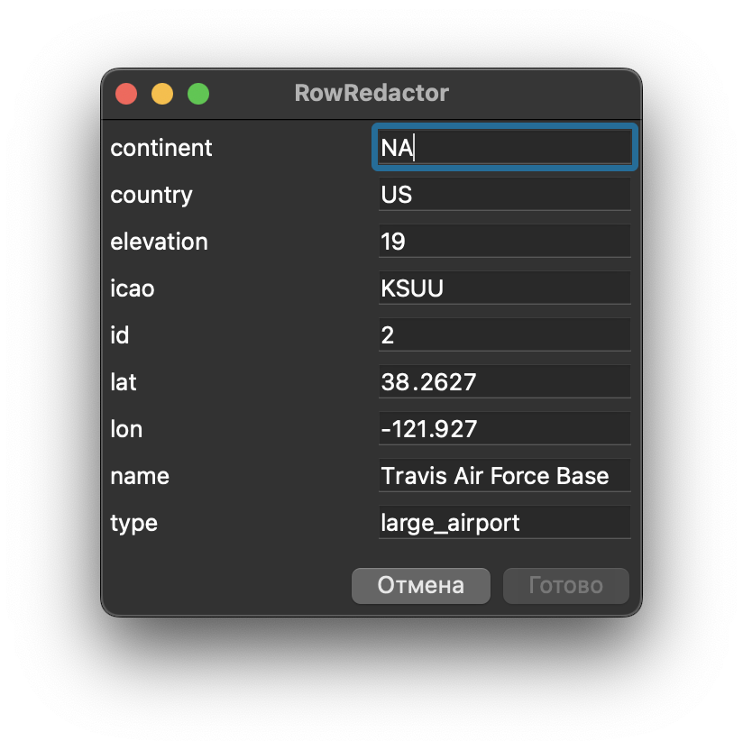

# ZloiRedactor

Programm for managing zl0i (https://github.com/zl0i) aicrafts and airbases database via his api.

## Screenshots
Autharization window

Main window

Aircrafts and airbases table.

The aircraft or airbase editor opens by double-clicking on a table element.

 
